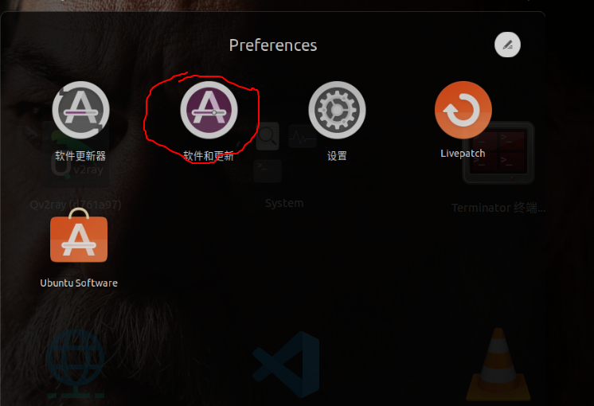
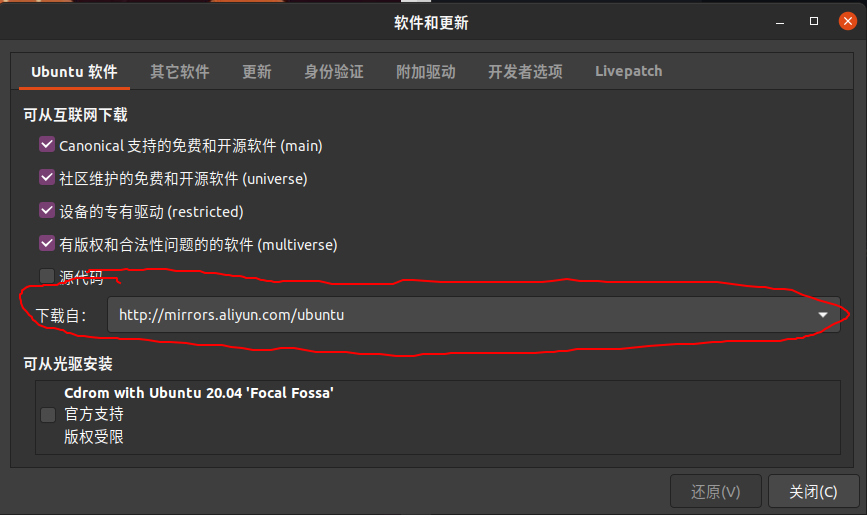
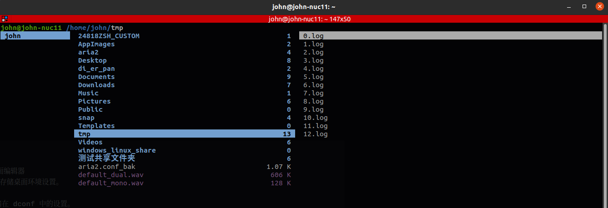
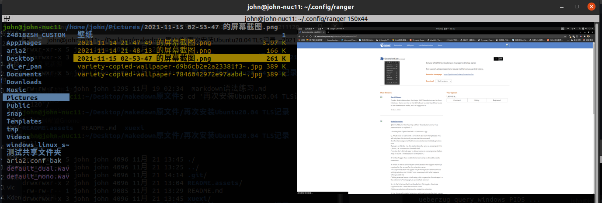
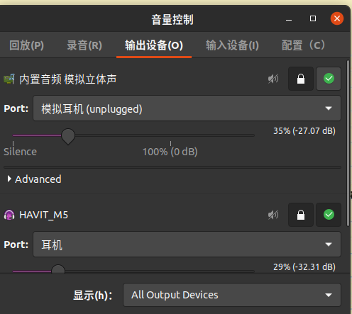
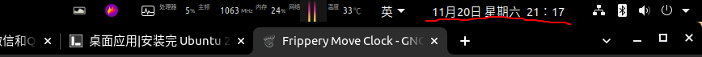
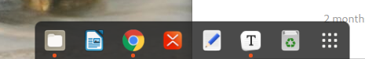
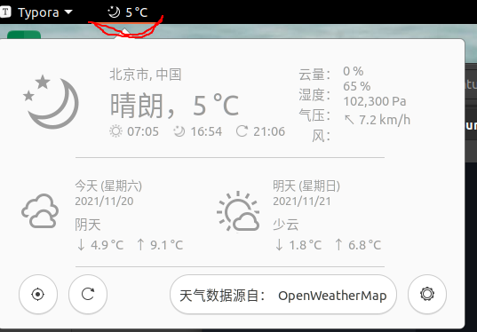
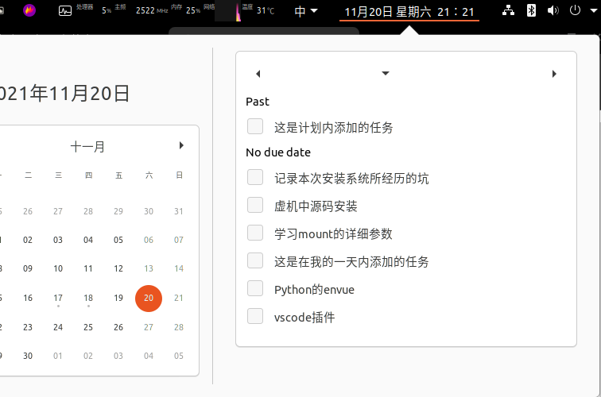

# 再次安装Ubuntu20.04 TLS记录		

# 															     写于 20211120

[toc]


## 一、系统基础配置

### 1. 更换系统软件更新源

使用的是系统自带的软件进行软件源的更改。





将软件源更改为```http://mirrors.aliyun.com/ubuntu``` 

### 2.  安装因授权所限的第三方软件包

   ```shell
   sudo apt install ubuntu-restricted-exteras
   ```

### 3. GNOME扩展功能插件安装

Ubuntu20.04 用的桌面系统是Gnome

查看自己当前的gnome-shell版本

```shell
gnome-shell --version
GNOME Shell 3.36.9
```

#### 3.1 Gnome-tweaks

​	`sudo apt install gnome-tweaks`
​	配置一些在gnome-center中无法配置的选项。

```java
Package: gnome-tweaks
Description: tool to adjust advanced configuration settings for GNOME
 GNOME Tweak Tool allows the adjustment of several advanced GNOME
 options that can't be configured in gnome-control-center.
 This includes things like:
  * fonts used in user interface elements and titlebar
  * font hinting and aliasing
  * alternative user interface themes
  * changes in window management behaviour
  * behaviour on laptop lid close
  * file manager desktop icons
  * icons in menus and buttons
```

#### 3.2 Gnome-extensions

​	`sudo apt install gnome-shell-extensions`
​	gnome-extesions 能够通过图形界面去设置Gnome-desk的一些设置，这样就不用cli了。

#### 3.3 通过浏览器配置Gnome-shell-extenions

​	打开<https://extensions.gnome.org/> 按照要求安装针对于不同浏览器的基础插件。
​	Ps:Chrome 的add-on 在Chrome web tore中，直接搜索安装即可。
​	安装完毕后，就可以通过浏览器直接安装相应的插件。

#### 3.4 重启Gnome Shell

​	安装后某些插件需要重新启动Gnome Shell后才可生效。
​	`ALT+F2`->`r`

### 4. 安装微信和QQ

安装wine

百度搜索就行，只需要注意wine版本；

发送图片需要sudo apt install libjpeg62:i386

qq同上

## 二、软件安装及配置

### 1. Chrome

​	直接在官网下载安装包(deb)即可；

### 2. 网易云音乐

`sudo apt install netease-cloud-music`

### 3. vlc

`sudo apt  install vlc`

### 4. Kdenlive 视频剪辑

​	https://kdenlive.org/en/download/
​	直接下载AppImage格式，添加可执行权限。

### 5. aira2和aria2-ng 下载工具

​	在github上搜索，按照说明进行安装就行。

​	给添加BT的trackers和DHT文件，要不达不到慢速。

主程序命令行启动：aria2c --conf-path=/home/john/aria2.conf

前台程序使用 aria2-ng(本地网页调用RPC)进行管理。

**自动添加treackers脚本**

```shell
#!/bin/bash
list=`wget -qO- https://raw.githubusercontent.com/ngosang/trackerslist/master/trackers_all.txt|awk NF|sed ":a;N;s/\n/,/g;ta"`
if [ -z "`grep "bt-tracker" 自己的配置目录/aria2.conf`" ]; then
    sed -i '$a bt-tracker='${list} 自己的配置目录/aria2.conf
    echo add......
else
    sed -i "s@bt-tracker=.*@bt-tracker=$list@g" 自己的配置目录/aria2.conf
    echo update......
fi
#授权脚本

```


### 6. vmware和irtualbox

- virtualbox安装官网安装就行；

- vmware

  安装 gcc和make

  sudo apt install make 再次打开vmware，这次报错如下：

  a required application is missing and Modconfig can not contine. xzcheck the log for more detail.

  这次打开终端执行如下命令：

  sudo vmware-modconfig --console --install-all 这次收到错误如下：

  [AppLoader] Use shipped Linux kernel AIO access library. An up-to-date "libaio" or "libaio1" package from your system is preferred. [AppLoader] GLib does not have GSettings support. Failed to setup build environment. 缺少libaio1包和libglib2.0-dev包，两条命令安装一下，

  sudo apt install libaio1 sudo apt install libglib2.0-dev 成功！！尤其是那个libglib2.0-dev，一直报错AppLoader] GLib does not have GSettings support.一直以为glib包是有 安装的，谁知道还需要libglib2.0-dev；

​		[VMware-Workstation-Full-16.2.1-18811642.x86_64.bundle]后缀名.bundle，给执行权限，然后执行安装。

### 7. docker

按照官方指引进行安装。

### 8. 火焰截图

​	`sudo apt install flameshot`

​	然后添加快捷键

### 9. OBS studio

​	按照官网要求进行安装https://obsproject.com/wiki/install-instructions#linux

### 10. AppImageLauncher

​	AppImage启动器，不需要手动添加桌面可执行文件及软件中心。

```java
Package: appimagelauncher
Version: 202110042218-stable-0f91801~ubuntu20.04.1
Description: AppImage helper
 Helper application for Linux distributions serving as a
 kind of "entry point" for running and integrating AppImages
 .
 AppImage provides a way for upstream developers to provide
 “native” binaries for Linux users just the same way they could
 do for other operating systems. It allow packaging applications
 for any common Linux based operating system, e.g., Debian.
 AppImages come with all dependencies that cannot be assumed
 to be part of each target system in a recent enough version and
 will run on most Linux distributions without further modifications.
 .
 AppImageLauncher makes your Linux desktop AppImage ready™.
 You can integrate AppImages with a single mouse click, and manage
 them from your application launcher. Install AppImageLauncher today
 for your distribution and enjoy using AppImages as easy as never before!

```

### 11. 有道词典

官方网址http://cidian.youdao.com/index-linux.html

[官方下载位置](http://codown.youdao.com/cidian/linux/youdao-dict_1.1.0-0-ubuntu_amd64.deb)

### 12. Konversation(IRC)

`sudo apt install konversation`

### 13. Dconf-editor (用于修改gnome配置)

​	单击图标，最大化，最小化。

```shell
Package: dconf-editor
Version: 3.36.7-0ubuntu1
Description: 简单的配置存储系统 - 图形界面编辑器
 DConf 是一个低层的键值对数据库，被设计用于存储桌面环境设置。
 .
 该软件包包含一个图形界面编辑器，用于修改存储在 dconf 中的设置。
```

### 14. evolution-ews(hotmail日历同步)

使Ubuntu自带的日历能够同步hotmail的日历，并且能够进行编辑。

`sudo apt install evolution-ews`

### 15. Gvim

图形界面的vim，能够共享复制粘贴系统clipoard(粘贴板内容)

### 16. ranger 终端里面的文件浏览器

`sudo apt install ranger`



使ranger内能够预览图片

通过pip安装ueberzug，并且安装依赖

```shell
This will work with most terminals and even with tmux but requires X11. Doesn't work well with tabs.
Install ueberzug. It can be installed with pip, in Debian the dependencies are: libx11-dev libxtst-dev python3-docopt python3-xlib python3-pil A package is available for Arch Linux, maybe others as well.
Add the following lines to your ~/.config/ranger/rc.conf.
set preview_images true
set preview_images_method ueberzug
You can speed the image preview process up even more by replacing pillow with pillow-simd
```




### 17. pavucontrol

更改声音的输入输出设备



### 18. variety(自动更换壁纸)

`sudo apt install variety`

```shell
Package: variety
Version: 0.8.3-1
Description: Wallpaper changer, downloader and manager
 Variety is a wallpaper manager for Linux systems. It supports numerous
 desktops and wallpaper sources, including local files and online
 services: Flickr, Wallhaven, Unsplash, and more.
 .
 Where supported, Variety sits as a tray icon to allow easy pausing and
 resuming. Otherwise, its desktop entry menu provides a similar set of
 options.
 .
 You can also install the following (suggested) packages to enhance Variety's
 functionality on certain desktop setups:
  * feh | nitrogen: used for wallpaper changing on i3, openbox, and dwm
  * gnome-shell-extension-appindicator | gnome-shell-extension-top-icons-plus:
    adds tray icon / indicator support to GNOME Shell, so that Variety's tray
    icon can be displayed
```

### 19. terminator

`sudo apt install terminator`

好用的终端（仿真器）

### 5. Gnome extensions 插件

1、compiz windows effect

窗口抖动特效


2、Frippery Move Clock

将屏幕顶端的时间图标挪到右侧



3、Dynamic Panel Transparency

顶栏自动变成透明

4、Dash to Dock



5、Destktop Icons

​	显示桌面图标

6、OpenWeather



7、Places Status Indicator


8、Sound Input & Output Device Chooser

​	选择输出音频设备

9、system-monitor

​	

10、Task Widget



11、TopIcons Plus

使微信、qq等wine图标缩放到右上角

12、Tweaks & Extensions in System Menu

在右上角菜单中显示tweaks设置

## 三、其他

lnav 日志查看

gotop 系统检测

iftop 网络流量查看（含端口）

iptraf-ng 流浪查看（图形化)

unrar rar文件解压缩

toilet ASCII 字体生成

neofetch ASCII字体显示设备信息

---

## 文章所参考的文章链接

> ###### 1. [安装完 Ubuntu 20.04 LTS “Focal Fossa” 后要做的 16 件事](https://linux.cn/article-12183-1.html "来自 Linux中国")
> ###### 2. [50 Best Ubuntu Apps You Should Be Using Right Now](https://itsfoss.com/best-ubuntu-apps/ "来自 It's FOSS")
>
> ###### 3. [Top 20 GNOME Extensions You Should Be Using Right Now](https://itsfoss.com/best-gnome-extensions/ "来自 FOSS")
>
> ###### 4.[How to Use GNOME Shell Extensions](https://itsfoss.com/gnome-shell-extensions/)
>
> 